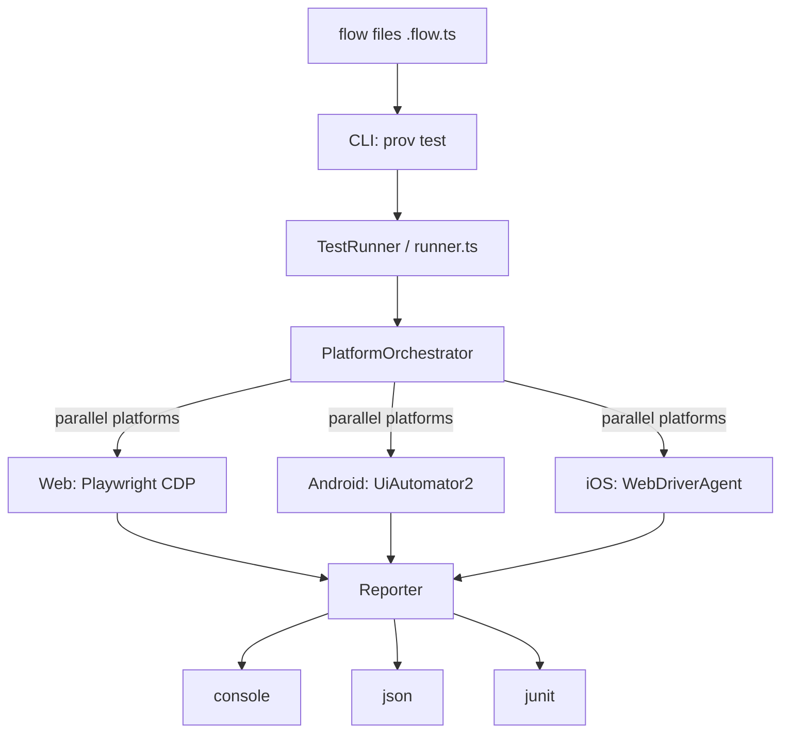
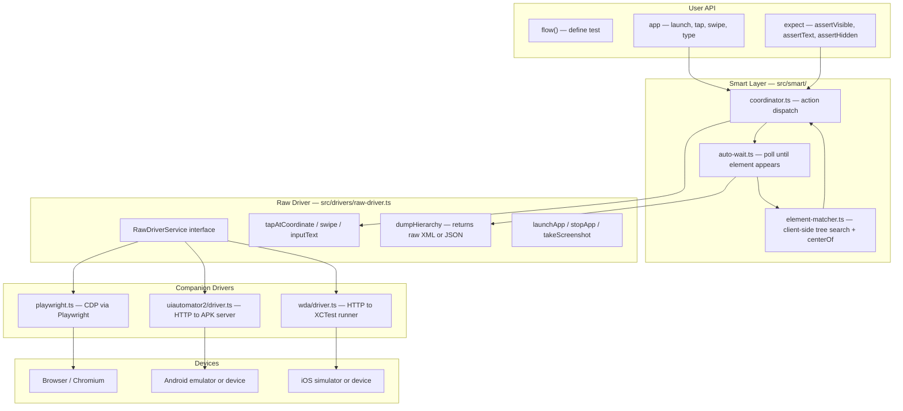
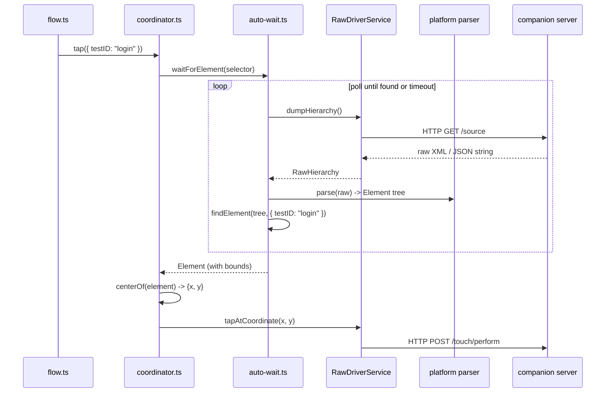
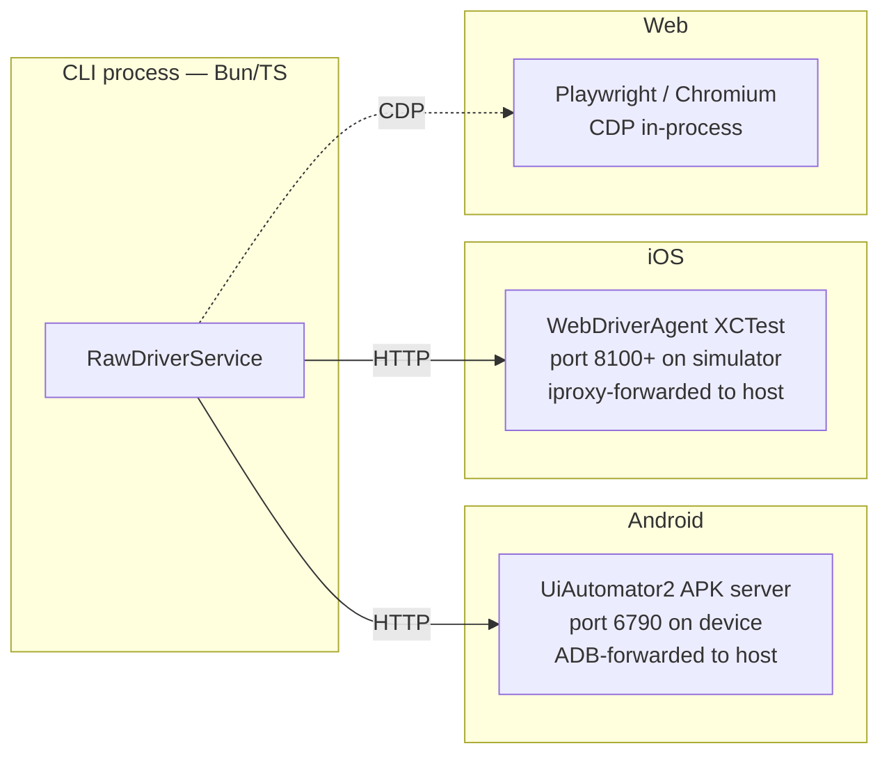
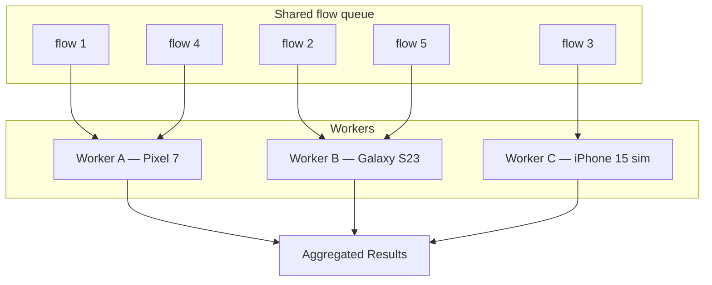
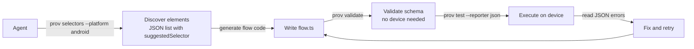
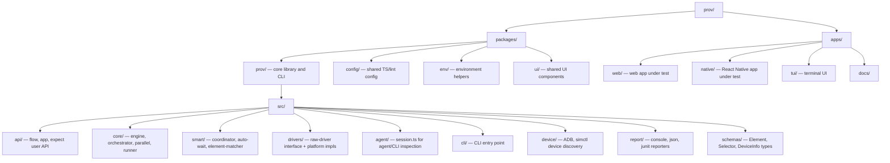

# prov Architecture

## 1. High-Level Architecture

Platforms run in parallel. Within each platform, flows run serially. Results are collected and handed to the configured reporter.

---

## 2. Layered Architecture

The Smart Layer never sees raw coordinates. It resolves selectors to elements, then derives coordinates before calling the thin RawDriver interface. The RawDriver knows nothing about selectors.

---

## 3. Element Resolution Flow

How `app.tap({ testID: "login" })` executes:

The parser is platform-specific (XML for Android/iOS, JSON for web) but always produces the same unified `Element` tree shape. All matching logic runs client-side in TypeScript.

---

## 4. Driver Architecture

The Android and iOS drivers are pure HTTP clients — no native bindings. The companion servers (UiAutomator2 APK and WDA XCTest bundle) are installed and port-forwarded during setup before the test run begins. The web driver uses Playwright's CDP API in-process.

---

## 5. Parallel Execution

Workers share a single atomic index into the flow array (`nextFlowIndex++`). Because Bun/Node is single-threaded, the increment is naturally safe with no mutex. A faster device finishes sooner and picks up the next flow immediately, so the queue drains at the speed of the fastest workers.

`parallel.ts` — `runParallel()` launches all workers with `Promise.all`, each looping over the queue until exhausted.

`orchestrator.ts` — `orchestrate()` is the simpler variant that runs one worker per platform with all flows for that platform in series, platforms in parallel.

---

## 6. Agent Workflow

How an AI agent uses prov to discover, write, and validate flows:

`session.ts` backs the `prov hierarchy` and `prov selectors` commands. `Session.selectors()` dumps the element tree, flattens it, and returns only visible elements that have a testID, accessibilityLabel, or text — each annotated with the best-priority selector to use in a flow file.

---

## 7. Monorepo Structure

All packages are managed by Bun workspaces and built with Turbo. The `prov` package is the only one that ships a binary (`prov` CLI). Other packages are libraries consumed by the apps or by `prov` itself.
