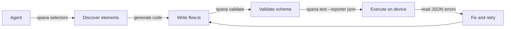

spana includes three commands designed specifically for AI agent-driven test authoring. They allow an agent to inspect the current UI state, generate flows, and validate them without needing a device connection.

## `spana selectors`

List all actionable elements on screen with suggested selectors.

```bash
spana selectors --platform <platform> [--pretty]
```

Output is a JSON array. Each entry describes a visible, interactable element and includes the best-priority selector to use in a flow file.

```bash
spana selectors --platform android
```

```json
[
  {
    "testID": "login-button",
    "text": "Sign In",
    "accessibilityLabel": null,
    "bounds": { "x": 24, "y": 480, "width": 328, "height": 48 },
    "suggestedSelector": { "testID": "login-button" }
  },
  {
    "testID": null,
    "text": "Forgot password?",
    "accessibilityLabel": null,
    "bounds": { "x": 120, "y": 544, "width": 136, "height": 20 },
    "suggestedSelector": { "text": "Forgot password?" }
  }
]
```

`suggestedSelector` follows priority: `testID` > `accessibilityLabel` > `text`. Feed this output directly to an agent to choose which element to interact with.

### Filtering with `jq`

```bash
# Elements that have a testID
spana selectors --platform web | jq '.[] | select(.testID != null)'

# Just the suggested selectors
spana selectors --platform ios | jq '[.[].suggestedSelector]'
```

## `spana hierarchy`

Dump the full UI element tree as structured JSON.

```bash
spana hierarchy --platform <platform> [--pretty]
```

Returns the complete accessibility tree for the current screen state — every element, including non-interactable ones.

```bash
spana hierarchy --platform web --pretty
```

```json
{
  "role": "application",
  "children": [
    {
      "role": "main",
      "children": [
        {
          "role": "textbox",
          "testID": "email-input",
          "text": "",
          "bounds": { "x": 24, "y": 200, "width": 328, "height": 44 }
        }
      ]
    }
  ]
}
```

Use `spana hierarchy` when `spana selectors` does not include the element you need, or to understand the structural relationship between elements.

## `spana validate`

Validate flow files without a device connection. Catches common mistakes before running tests.

```bash
spana validate [path]
```

`path` defaults to `flowDir`. Exits `0` if all flows are valid, non-zero if any errors found. Does not execute the flows.

**Checks performed:**

- Flow files have a valid default export with `name` and `fn`
- No duplicate flow names across files
- Platform values are valid (`web`, `android`, `ios` only)
- Flow directory exists and contains flow files

```bash
spana validate
# ✓ 5 flow(s) valid

spana validate flows/
# ✗ flows/login.flow.ts: Duplicate flow name "Login test" (also in flows/auth.flow.ts)
# ✗ flows/broken.flow.ts: Invalid platform "windows" — must be web, android, or ios
# ✗ flows/empty.flow.ts: export default is not a FlowDefinition
```

Use `spana validate` in CI preflight or as part of an agent loop before committing generated flow files.

## Agent workflow

The typical agent-driven authoring loop:

```bash
# 1. Navigate the app to the screen you want to test, then discover elements
spana selectors --platform android | jq '.[] | select(.testID != null)'

# 2. Generate and write a flow file (done by the agent)

# 3. Validate the flow without a device
spana validate flows/my-new-flow.ts

# 4. Run the flow and capture JSON results
spana test flows/my-new-flow.ts --reporter json 2>&1

# 5. Read errors from JSON output and iterate
spana test flows/my-new-flow.ts --reporter json 2>&1 | jq '.results[] | select(.status == "failed")'
```

This loop requires no manual interaction. `spana validate` catches structural errors before device time is spent. `--reporter json` gives the agent machine-readable pass/fail data with error messages.



## Agent skill file

spana ships with a ready-made skill file for AI coding agents at `.agents/skills/spana-testing/SKILL.md` in the repo. It covers element discovery, flow writing patterns, selectors, validation, error handling, and platform-specific notes.

**To use it with your AI agent:**

1. Copy the skill file into your project:

   ```bash
   mkdir -p .agents/skills/spana-testing
   cp node_modules/spana-test/.agents/skills/spana-testing/SKILL.md .agents/skills/spana-testing/
   ```

2. Or reference it in your `CLAUDE.md` / `AGENTS.md`:

   ```markdown
   ## Testing

   For writing E2E tests, follow the spana testing skill at:
   .agents/skills/spana-testing/SKILL.md
   ```

3. Or point your agent to it directly:
   ```
   Read .agents/skills/spana-testing/SKILL.md and use it to write a test for the login flow.
   ```

The skill file is self-contained — it includes the full API reference, workflow loop, and common patterns so the agent can start writing tests immediately.
